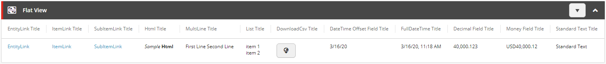
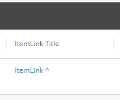
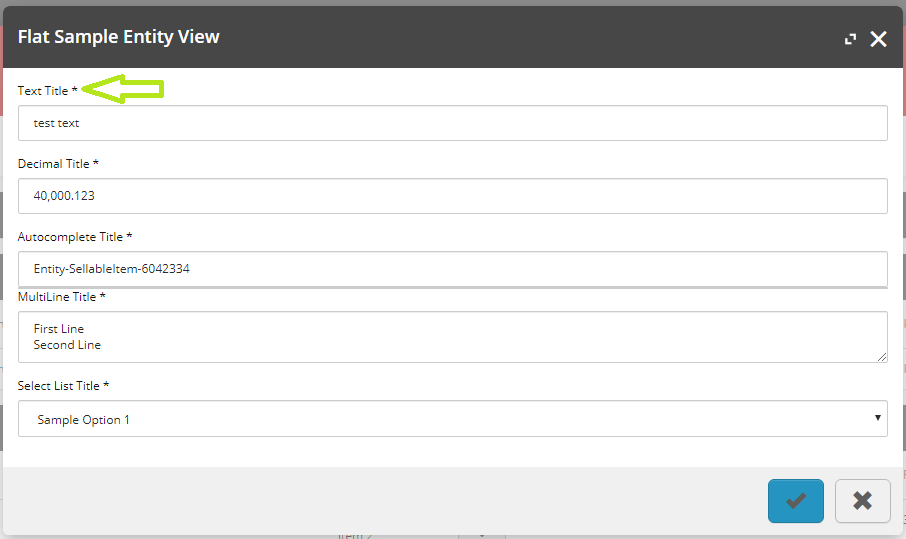
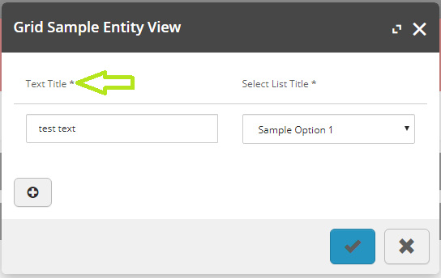
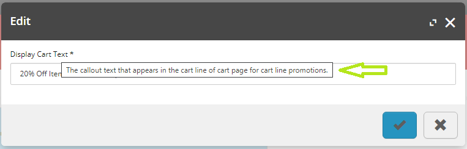
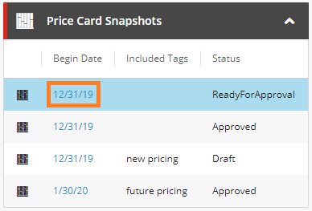
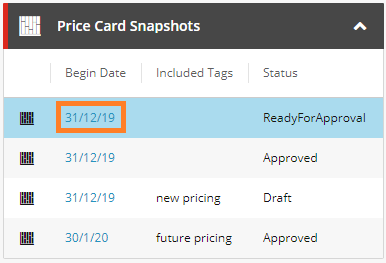

# Extended Sitecore Commerce BizFx
Custom Sitecore Commerce BizFx project with extended functionality for the Business Tools.

- [Supported Sitecore Experience Commerce Versions](#supported-sitecore-experience-commerce-versions)
- [Features](#features)
- [Installation Instructions](#installation-instructions)
- [Known Issues](#known-issues)
- [Disclaimer](#disclaimer)

## Supported Sitecore Experience Commerce Versions
- [XC 9.2 (documentation here)](https://github.com/ajsuth/Ajsuth.BizFx/tree/release/9.2/master)
- [XC 9.3 (documentation here)](https://github.com/ajsuth/Ajsuth.BizFx/tree/release/9.3/master)
- XC 10.0

## Features
- [Custom Entity Links and Custom Item Links](#custom-entity-links-and-custom-item-links)
- [UI Types Enabled in Flat Entity Views](#ui-types-enabled-in-flat-entity-views)
- [Target Attribute Support for Hyperlink Values](#target-attribute-support-for-hyperlink-values)
- [Required Field Indicators For Data Entry Modals](#required-field-indicators-for-data-entry-modals)
- [Description Tooltip for View Properties](#description-tooltip-for-view-properties)
- [Support for en-AU Locale](#support-for-en-au-locale)

### Custom Entity Links and Custom Item Links
Custom entity and item links are more flexible than the standard entity and item links as they allow the configurations to be specified at the view property level with a fallback to the entity view values where values have not been specified. This allows entity views to contain multiple links under a single entity view that resolve to different routes.

**Dependencies:** [Ajsuth.Foundation.Views.Engine](https://github.com/ajsuth/Ajsuth.Foundation.Views.Engine/tree/release/9.3/master)

#### Custom Entity Link

The custom entity link will render _\<domain\>/entityView/Master/\<entity version\>/\<entity id\>_ 

e.g. _https://bizfx.local/entityView/Master/2/Entity-SellableItem-12345_

```
var customEntityLink = new ViewProperty
{
    Name = "Custom Entity Link",
    Value = "Custom Entity Link"
};
customEntityLink.SetCustomEntityLink(2, "Entity-SellableItem-12345");
entityView.Properties.Add(customEntityLink);
```

_Sample Custom Entity Link Usage._

#### Custom Item Link

The custom item link will render _\<domain\>/entityView/\<view name\>/\<entity version\>/\<entity id\>/\<item id\>_ 

e.g. _https://bizfx.local/entityView/MyView/3/Entity-SellableItem-12345/67890_

```
var customItemLink = new ViewProperty
{
    Name = "Custom Item Link",
    Value = "Custom Item Link"
};
customItemLink.SetCustomItemLink("MyView", 3, "Entity-SellableItem-12345", "67890");
// OR
// customItemLink.SetCustomItemLink("MyView", 3, "Entity-SellableItem-12345|67890");
entityView.Properties.Add(customItemLink);
```

_Sample Custom Item Link Usage._

### UI Types Enabled in Flat Entity Views
For entity views of UI Hint type _'Flat'_, the view properties' UI Types are now resolved and rendered accordingly.

This includes the following UI Types:
- Custom Entity Link (See [Custom Entity Links and Custom Item Links](#custom-entity-links-and-custom-item-links) for more details)
- Custom Item Link (See [Custom Entity Links and Custom Item Links](#custom-entity-links-and-custom-item-links) for more details)
- Entity Link
- Item Link
- Sub Item Link
- Html
- Multiline (doesn't format new lines, technically renders as per default string data type)
- List
- Download CSV
- String By Data Type (OriginalType)
  - DateTimeOffset
    - FullDateTime UI Type will render the time as well
  - Decimal
  - Sitecore.Commerce.Core.Money
  - Html
  - List
  - String (default)



_Sample 'Flat' entity view with various UI Types._

### Target Attribute Support for Hyperlink Values
Links in BizFx may direct the user away from the current page, counter-intuitive to the flow of user navigation. Enabling the target attribute to be configured for links, specifically for opening links in a new window or tab via the '_blank' value, improves the UX of customisations to the Business Tools.

For the '_blank' target type, the link is opened in a new window or tab and is rendered with a '^' to signify that the link will be opened externally.

**Dependencies:** [Ajsuth.Foundation.Views.Engine](https://github.com/ajsuth/Ajsuth.Foundation.Views.Engine/tree/release/9.3/master)



_Sample 'Flat' entity view with various UI Types._

To configure a link, the view property should be configured with a new policy with PolicyId "Target" and single model with Name _\<target type\>_, e.g. "_blank". The plugin Ajsuth.Foundation.Views.Engine contains the view property extension method _SetTargetPolicy()_ and contains constants for available values to improve development.

```
// Default target value is '_blank'
entityLinkViewProperty.SetTargetPolicy();

// Specify the target type
itemLinkViewProperty.SetTargetPolicy(ViewsConstants.ViewProperty.Targets.Self);
```

### Automatic Page Redirect On Entity and Component Creation
When entities and components are created via BizFx, the user is automatically redirected to the entity view page for the newly create entity or component.

Supported Entities:
- Catalog
- Category
- Sellable Item
- Inventory Set
- Price Book
- Price Card
- Promotion Book
- Promotion

Supported Components:
- Price Snapshot
- Variant

**Dependencies:** [Ajsuth.Foundation.Views.Engine](https://github.com/ajsuth/Ajsuth.Foundation.Views.Engine/tree/release/9.3/master)

### Required Field Indicators For Data Entry Modals
Improved UX for required fields, rendering a '*' after the field title for required view properties. Applies to modal entity views of UI Hint _Flat_ and _Grid_.

_Flat_ Entity View Supported Ui Types
- Autocomplete
- SelectList
- Multiline
- String By Data Type
  - String
  - Decimal



_Sample 'Flat' entity view with required field indicators for supported types._

_Grid_ Entity View Supported Ui Types
- SelectList
- String By Data Type
  - String



_Sample 'Grid' entity view with required field indicators for supported types._

### Description Tooltip for View Properties
Improved UX for form input fields, rendering description tooltips on mouse hover to provide context and facilitate data entry for business users.

**Dependencies:** [Ajsuth.Foundation.Views.Engine](https://github.com/ajsuth/Ajsuth.Foundation.Views.Engine/tree/release/9.3/master)



_Sample description tooltip in modal view._

### Support for en-AU Locale
The en-AU locale has been included as part of the default set of applicable locales and can be configured by setting the **Language** configuration in _\src\assets\config.json_ to _'en-AU'_. The most notable areas where the locale is obvious in the BizFx tooling is the date/time formatting.



_The date format display for the default 'en' date locale._



_The date format display when locale is set to 'en-AU'._

## Installation Instructions
1. Download the repository.
2. Diff the change between the repository's _src_ folder and your BizFx development solution, ensuring changes don't conflict with any changes introduced by you and your team.
3. Copy the _src_ folder into the BizFx solution (not the deployed website folder).
4. Build and deploy the BizFx solution as per your preferred approach.

## Known Issues
| Feature                 | Description | Issue |
| ----------------------- | ----------- | ----- |
|                         |             |       |

## Disclaimer
The code provided in this repository is sample code only. It is not intended for production usage and not endorsed by Sitecore.
Both Sitecore and the code author do not take responsibility for any issues caused as a result of using this code.
No guarantee or warranty is provided and code must be used at own risk.
